<div align="center">
<picture>
  <source media="(prefers-color-scheme: dark)" srcset=".github/brand/banner-night.svg">
  
</picture>
<br><br>
<a href="#usage"><picture><source media="(prefers-color-scheme: dark)" srcset=".github/brand/tab-usage-night.svg"></picture></a>
<a href="#modules"><picture><source media="(prefers-color-scheme: dark)" srcset=".github/brand/tab-modules-night.svg"></picture></a>
<a href="#license"><picture><source media="(prefers-color-scheme: dark)" srcset=".github/brand/tab-license-night.svg"></picture></a>
</div>

<br>

Netcrawler is a modular shell-based toolkit for network testing and auditing. Each capability lives in its own module and is accessible from a single interactive menu.

```
1) Stress Test    → load test a target endpoint
2) Network Scan   → discover hosts and open ports
3) ARP Poison     → local network interception (requires authorization)
4) WiFi Attacks   → wireless network auditing
5) Audit Report   → generate a structured audit summary
```

> **For authorized testing only.** Only use against systems you own or have explicit written permission to test.

<p>
<a name="usage"></a>
<picture><source media="(prefers-color-scheme: dark)" srcset=".github/brand/section-usage-night.svg"></picture>
</p>

```bash
chmod +x netcrawler.sh
./netcrawler.sh
```

<p>
<a name="modules"></a>
<picture><source media="(prefers-color-scheme: dark)" srcset=".github/brand/section-modules-night.svg"></picture>
</p>

| Module | File | Purpose |
|--------|------|---------|
| Stress Test | `modules/stress.sh` | HTTP load testing |
| Network Scan | `modules/scan.sh` | Host and port discovery |
| ARP Poison | `modules/arp.sh` | LAN traffic interception |
| WiFi Attacks | `modules/wifi.sh` | Wireless auditing |
| Audit Report | `modules/audit.sh` | Report generation |

<p>
<a name="license"></a>
<picture><source media="(prefers-color-scheme: dark)" srcset=".github/brand/section-license-night.svg"></picture>
</p>

MIT — see [LICENSE](LICENSE).

<div align="center">
Made with ❤️ by <a href="https://github.com/NoamFav">NoamFav</a>
</div>

<br>

<a href="https://nf-software.com">
<picture>
  <source media="(prefers-color-scheme: dark)" srcset=".github/brand/footer-night.svg">
  
</picture>
</a>
